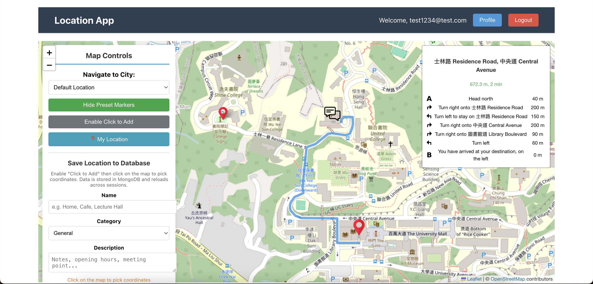

# GeoPin - Location-Based Web Application

A full-stack web application for saving, managing, and navigating between custom locations on an interactive map. Built with React, Express.js, and MongoDB.



## Tech Stack

| Layer | Technology |
|-------|-----------|
| **Frontend** | React 18, Vite, Leaflet, react-leaflet |
| **Backend** | Node.js, Express 5 |
| **Database** | MongoDB Atlas |
| **Maps** | OpenStreetMap, Leaflet Routing Machine |
| **DevOps** | Docker, Docker Compose, Google Cloud App Engine |

## Features

### Interactive Map with Route Finding
- Leaflet-powered map with custom image icons for different marker categories
- Click-to-add markers with coordinates, descriptions, and category tags
- Device geolocation (centers map on current position)
- Route calculation between two points with turn-by-turn directions, distance, and time estimates
- City/location search and navigation

### Persistent Location Management
- Save custom locations to MongoDB with name, category, and description
- Filter saved locations by category (food, work, travel, etc.) or by owner
- Full CRUD operations -- locations persist across sessions and devices
- Category-colored markers rendered on the map in real time

### Authentication and User Profiles
- Email/password registration and login
- User profile page supporting multiple data types (text, number, date, URL)
- View/edit modes with live profile image preview
- Server-side input validation

## Architecture

```
frontend/                          backend/
├── src/                           ├── config/
│   ├── components/                │   └── database.mjs        # MongoDB connection pool
│   │   ├── Auth/                  ├── routes/
│   │   │   ├── Login.jsx          │   ├── auth.mjs            # Auth endpoints
│   │   │   ├── Registration.jsx   │   └── locations.mjs       # Location CRUD
│   │   │   ├── Profile.jsx        ├── app.mjs                 # Express server
│   │   │   └── Logout.jsx         ├── Dockerfile
│   │   └── Map/                   └── app.yaml                # GCP config
│   │       └── CombinedMap.jsx
│   ├── App.jsx
│   └── main.jsx
├── Dockerfile
└── vite.config.js
docker-compose.yml                 # Orchestrates both services
```

## API Endpoints

| Method | Endpoint | Description |
|--------|----------|-------------|
| `POST` | `/register` | Register a new user |
| `POST` | `/auth` | Login |
| `POST` | `/check-account` | Check if email exists |
| `GET` | `/profile/:email` | Get user profile |
| `PUT` | `/profile/:email` | Update user profile |
| `GET` | `/locations` | List locations (filterable by owner/category) |
| `POST` | `/locations` | Create a location |
| `PUT` | `/locations/:id` | Update a location |
| `DELETE` | `/locations/:id` | Delete a location |

## Getting Started

### Docker (recommended)

```bash
docker-compose up -d
```

- Frontend: http://localhost:5173
- Backend API: http://localhost:53840

### Manual

```bash
# Backend
cd backend && npm install && npm start    # runs on :53840

# Frontend (separate terminal)
cd frontend && npm install && npm run dev  # runs on :5173
```

> Requires a MongoDB connection string configured in `backend/config/database.mjs`.

## What I Learned

- Designing a RESTful API and connecting it to a React frontend end-to-end
- Working with geospatial data and mapping libraries (Leaflet, routing)
- Containerizing a multi-service app with Docker Compose
- Configuring cloud deployment on Google Cloud App Engine
- Managing application state across authentication, profiles, and map interactions
